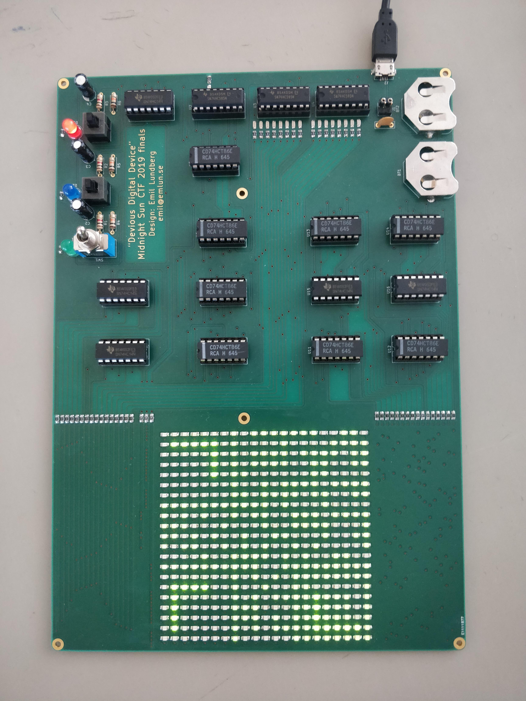

# Devious Digital Device

```
Our operatives have found this device inside the base. Please help us figure out what it does. Note: Physical challenge. Go to the admin room to find the challenge.
```

This was a hardware based challenge for which you need the challenge PCB to solve. the PCB looked like this:


The first thing we did was google the text on the chips, from which we learned that there were 8 XOR gates (chips with white text), 3 8-bit shift registers (top row on the right) and 4 Hex Schmitt-Trigger Inverters (the rest) which we assumed behaved like NOT gates.

There was a 21x21 LED matrix on the board with seemingly random LEDS turned on, however we quickly noticed that on the top left and bottom corners relative to the image we can see something that resembles broken QR code markers, from which we deduced that our goal was to make the matrix show a valid QR code which would most likely be our flag.

We can see 16 LEDs besides the 2 right most shift registers, which indicate the state of each output. There were 2 buttons and one switch on the board. By repeatedly pressing the blue LED button we could shift the registers and cycle through a seemingly random sequence of bits. This random sequence was however not used in our solution, so I will skip it.

Since there was no memory on the board, we often power cycled it to get it to a known state. After a power cycle, all 16 shift register bits would light up. By pressing the blue LED button we could shift a 0 into the shift register indefinitely. By pressing the red LED button we could go into the other pseudo random mode which we didn't end up needing. We noticed that depending on the state of the green LED switch we could control if the bit which would become visible in the 16 LEDs after two shifts would go through a NOT gate or not. Since we could shift an indefinite amount of 0's into the register after a power cycle it was trivial to by varying the switch be able to set the 16 LEDs in any arbitrary state.

We guessed that the condition for the QR code to be properly displayed was that we needed to have the shift register in a specific state, and so we went searching for what this state could be. On the bottom left of the PCB relative to the image we can see a row of 19 resistors, out of which 3 are separated. we followed the traces of the 3 separated resistors and noticed that they each lead to all LEDs of one of the 3 QR code markers that had to be lit up for the QR code to be valid. since those 3 resistors had to be on for the QR code to properly show, we tried to see what would happen if we powered all traces on the bottom left of the board.

We noticed that all 16 shift register LEDs were connected to the resistors we wanted to power either directly or through a NOT gate. We therefore followed the traces and figured out in which state each bit had to be for their corresponding traces on the bottom left to be powered. After we entered this combination of bits into the shift register, the LED matrix showed the following:


Now we only have to use some editing software to correct the colors on the QR code so its clearly visible and scannable or manually copy the code onto an image like we did and we get the flag!

`midnight{sh1fty!}`