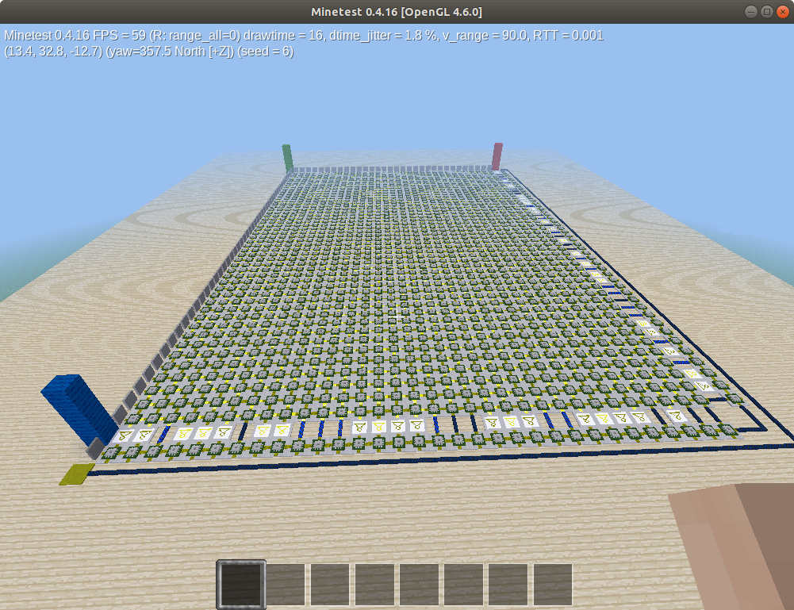

# mineminemine

```
Someone encoded a 10-character password into this weird circuit. Flip the switches to encode single bits. The password starts with MSB first at the red pillar, towards the green. Then from the green to the blue pillar. When you've entered the right password, press the button next to the blue pillar to verify. Encode this password in SECT{...} to obtain the flag. (Works with minetest 0.4.16+repack-4 and mesecons 2017.03.05-1 from Ubuntu bionic 18.04.2 LTS)
```

The first thing that came to mind when I saw this challenge was the minetest challenge from this years google ctf, for which liveoverflow made a great walkthrough: <https://www.youtube.com/watch?v=nI8Q1bqT8QU>. After installing the correct version of minetest with the correct version of the mesecons mod we were greeted with this:



All the blocks in the middle of the circuit are mesecons FPGAs, which are basically programable logic gates. each of them took two inputs, one on the north and one on the west side, and used a programmed logic circuit to output two values on the east and south sides. On the north and west sides of the circuit there were 80 input levers, and on the south and east sides the outputs were given, which sometimes went through NOT gates and were all then ANDed together. It was clear that the objective was to position the levers in such a way that the output was on, and then the flag was encoded in the levers. This turned out to be a very similar challenge to the google ctf one, where the solution is simply to parse the map to extract the circuit and then plug it in to a SAT solver like z3.

I found the documentation for the minetest world format [here](https://github.com/DS-Minetest/minetest/blob/0431b48a775c50113f517f2fb8ba14904a1eaca6/doc/world_format.txt), which is from a pull request to document version 28 of the minetest world format since the first byte in each blob in the world file was 1C signifying version 28. From here we just need to follow the documentation. I created a python function that dumps the circuit of an FPGA given its coordinates. This function was then used to fetch all FPGAs and rebuild the circuit in the z3 format. The code for this is below. After the circuit was extracted and rebuilt, all that was left was to tell z3 that the solution should be true and to solve it, and it spit out the flag!

`SECT{B1mB4mB0Om}`

parseworld.py:

```python
import math
import zlib
import sqlite3


def getBlockAsInteger(*p):
    return int64(p[2] * 16777216 + p[1] * 4096 + p[0])


def int64(u):
    while u >= 2 ** 63:
        u -= 2 ** 64
    while u <= -2 ** 63:
        u += 2 ** 64
    return u


all_block_logic = {}


def get_block(x, y, z):
    calculated = all_block_logic.get((x, y, z))
    if calculated:
        return calculated

    block_x = math.floor(x / 16)
    block_y = math.floor(y / 16)
    block_z = math.floor(z / 16)
    block_position = getBlockAsInteger(block_x, block_y, block_z)
    c.execute("select * from blocks where pos=%s" % (block_position))
    blob = c.fetchall()[0][1]
    version = blob[0]
    content_width = blob[4]
    params_width = blob[5]
    assert version == 28 and content_width == 2 and params_width == 2
    decompressor = zlib.decompressobj()
    decompressor.decompress(blob[6:])

    decompressor2 = zlib.decompressobj()
    inflated2 = decompressor2.decompress(decompressor.unused_data)

    assert inflated2[0] == 2
    metadata_count = inflated2[1] << 8 | inflated2[2]
    metadata_pointer = 3
    for _ in range(metadata_count):

        position = int.from_bytes(
            inflated2[metadata_pointer : metadata_pointer + 2], byteorder="big"
        )
        metadata_pointer += 2
        node_in_block_x = position & 0b1111
        node_in_block_y = position >> 4 & 0b1111
        node_in_block_z = position >> 8 & 0b1111

        num_vars = int.from_bytes(
            inflated2[metadata_pointer : metadata_pointer + 4], byteorder="big"
        )
        metadata_pointer += 4

        for _ in range(num_vars):
            key_len = int.from_bytes(
                inflated2[metadata_pointer : metadata_pointer + 2], byteorder="big"
            )
            metadata_pointer += 2
            key = inflated2[metadata_pointer : metadata_pointer + key_len]
            metadata_pointer += key_len
            val_len = int.from_bytes(
                inflated2[metadata_pointer : metadata_pointer + 4], byteorder="big"
            )
            metadata_pointer += 4
            val = inflated2[metadata_pointer : metadata_pointer + val_len]
            metadata_pointer += val_len

            metadata_pointer += 1

            if key == b"instr":
                all_block_logic[
                    (
                        block_x * 16 + node_in_block_x,
                        block_y * 16 + node_in_block_y,
                        block_z * 16 + node_in_block_z,
                    )
                ] = val

        assert inflated2[metadata_pointer : metadata_pointer + 13] == b"EndInventory\n"
        metadata_pointer += 13

    return all_block_logic[(x, y, z)]


conn = sqlite3.connect("chal/map.sqlite")
c = conn.cursor()
```

solvemine.py:

```python
from z3 import *
from parseworld import get_block


def encoded_to_z3(encoded, registers, A, B):
    if encoded[0] == "A":
        left = A
    elif encoded[0] == "B":
        left = B
    else:
        left = registers[int(encoded[0])]

    if encoded[2] == "A":
        right = A
    elif encoded[2] == "B":
        right = B
    else:
        right = registers[int(encoded[2])]

    if encoded[1] == "&":
        return And(left, right)
    elif encoded[1] == "|":
        return Or(left, right)
    elif encoded[1] == "~":
        return Not(left, right)
    elif encoded[1] == "^":
        return Xor(left, right)
    elif encoded[1] == "?":
        return Not(And(left, right))
    elif encoded[1] == "_":
        raise NotImplementedError
    elif encoded[1] == "=":
        return left == right


print("Creating inputs...")
inputs = [Bool("%s" % i) for i in range(10 * 8)]

# (x,y,z,dir), dir == "A" or "B" or "C" or "D"
blocks = {}

# add inputs as fake blocks
for i, lever in enumerate(inputs[:32]):
    x = 31 - i
    y = 19
    z = 48
    blocks[(x, y, z, "D")] = lever

for i, lever in enumerate(inputs[32:]):
    x = -1
    y = 19
    z = 47 - i
    blocks[(x, y, z, "C")] = lever

print("Parsing FPGAs...")
# parse all blocks
for x in range(0, 31 + 1):
    for z in range(47, 0 - 1, -1):
        encoded_expression = get_block(x, 19, z).decode()
        encoded_expressions = encoded_expression.split("/")[:12]
        registers = []
        A = blocks[(x - 1, 19, z, "C")]
        B = blocks[(x, 19, z + 1, "D")]
        for i in range(10):
            registers.append(encoded_to_z3(encoded_expressions[i], registers, A, B))

        blocks[(x, 19, z, "C")] = simplify(
            encoded_to_z3(encoded_expressions[10], registers, A, B)
        )
        blocks[(x, 19, z, "D")] = simplify(
            encoded_to_z3(encoded_expressions[11], registers, A, B)
        )

print("Connecting everything...")

expression = And(
    Not(blocks[(31, 19, 47, "C")]),
    Not(blocks[(31, 19, 46, "C")]),
    blocks[(31, 19, 45, "C")],
    blocks[(31, 19, 44, "C")],
    blocks[(31, 19, 43, "C")],
    Not(blocks[(31, 19, 42, "C")]),
    blocks[(31, 19, 41, "C")],
    Not(blocks[(31, 19, 40, "C")]),
    Not(blocks[(31, 19, 39, "C")]),
    blocks[(31, 19, 38, "C")],
    blocks[(31, 19, 37, "C")],
    blocks[(31, 19, 36, "C")],
    Not(blocks[(31, 19, 35, "C")]),
    Not(blocks[(31, 19, 34, "C")]),
    Not(blocks[(31, 19, 33, "C")]),
    Not(blocks[(31, 19, 32, "C")]),
    blocks[(31, 19, 31, "C")],
    Not(blocks[(31, 19, 30, "C")]),
    Not(blocks[(31, 19, 29, "C")]),
    blocks[(31, 19, 28, "C")],
    blocks[(31, 19, 27, "C")],
    Not(blocks[(31, 19, 26, "C")]),
    blocks[(31, 19, 25, "C")],
    Not(blocks[(31, 19, 24, "C")]),
    blocks[(31, 19, 23, "C")],
    blocks[(31, 19, 22, "C")],
    Not(blocks[(31, 19, 21, "C")]),
    blocks[(31, 19, 20, "C")],
    blocks[(31, 19, 19, "C")],
    Not(blocks[(31, 19, 18, "C")]),
    blocks[(31, 19, 17, "C")],
    Not(blocks[(31, 19, 16, "C")]),
    blocks[(31, 19, 15, "C")],
    Not(blocks[(31, 19, 14, "C")]),
    Not(blocks[(31, 19, 13, "C")]),
    blocks[(31, 19, 12, "C")],
    blocks[(31, 19, 11, "C")],
    blocks[(31, 19, 10, "C")],
    blocks[(31, 19, 9, "C")],
    blocks[(31, 19, 8, "C")],
    Not(blocks[(31, 19, 7, "C")]),
    Not(blocks[(31, 19, 6, "C")]),
    blocks[(31, 19, 5, "C")],
    Not(blocks[(31, 19, 4, "C")]),
    blocks[(31, 19, 3, "C")],
    Not(blocks[(31, 19, 2, "C")]),
    Not(blocks[(31, 19, 1, "C")]),
    blocks[(31, 19, 0, "C")],
    blocks[(31, 19, 0, "D")],
    blocks[(30, 19, 0, "D")],
    Not(blocks[(29, 19, 0, "D")]),
    blocks[(28, 19, 0, "D")],
    Not(blocks[(27, 19, 0, "D")]),
    Not(blocks[(26, 19, 0, "D")]),
    Not(blocks[(25, 19, 0, "D")]),
    Not(blocks[(24, 19, 0, "D")]),
    blocks[(23, 19, 0, "D")],
    blocks[(22, 19, 0, "D")],
    Not(blocks[(21, 19, 0, "D")]),
    Not(blocks[(20, 19, 0, "D")]),
    Not(blocks[(19, 19, 0, "D")]),
    blocks[(18, 19, 0, "D")],
    blocks[(17, 19, 0, "D")],
    blocks[(16, 19, 0, "D")],
    Not(blocks[(15, 19, 0, "D")]),
    Not(blocks[(14, 19, 0, "D")]),
    Not(blocks[(13, 19, 0, "D")]),
    Not(blocks[(12, 19, 0, "D")]),
    blocks[(11, 19, 0, "D")],
    blocks[(10, 19, 0, "D")],
    blocks[(9, 19, 0, "D")],
    Not(blocks[(8, 19, 0, "D")]),
    Not(blocks[(7, 19, 0, "D")]),
    blocks[(6, 19, 0, "D")],
    Not(blocks[(5, 19, 0, "D")]),
    Not(blocks[(4, 19, 0, "D")]),
    Not(blocks[(3, 19, 0, "D")]),
    blocks[(2, 19, 0, "D")],
    Not(blocks[(1, 19, 0, "D")]),
    Not(blocks[(0, 19, 0, "D")]),
)

print("Solving...")

s = Solver()

s.add(expression == True)

check = s.check()
print(check)

if check == sat:
    model = s.model()
    result = [0] * 80

    for d in model.decls():
        result[int(d.name())] = model[d]

    boolstr = "".join(["1" if boolean else "0" for boolean in result])

    print("".join([chr(int(boolstr[i : i + 8], base=2)) for i in range(0, 80, 8)]))
```
